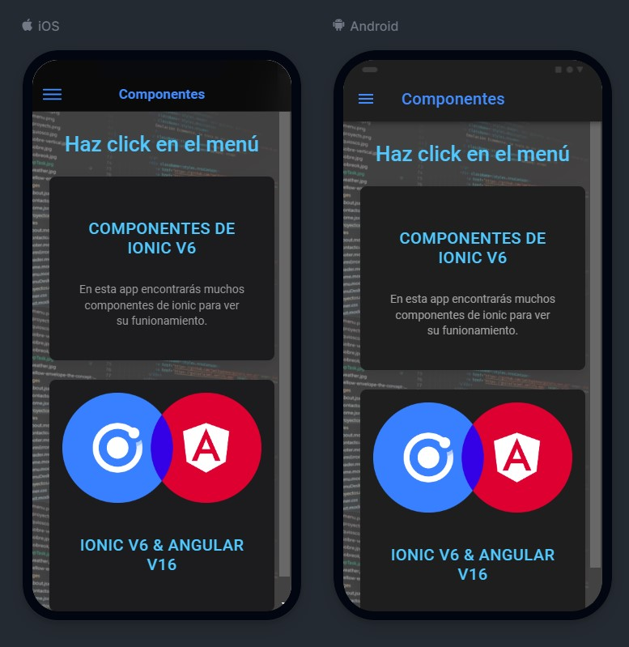

# Ionic Components 

This project was generated with [Angular CLI](https://github.com/angular/angular-cli) version 16.2.2. And [Ionic](https://ionicframework.com) version 6

## Colección de Componentes

```
Se trata de una app en Ionic que recoge la mayoria de componentes de este Framework 
a modo de documentación:

```
 - ion-action-sheet
 - ion-button
 - ion-list
 - ion-card
 - y muchos más...

```
Para visualizar el contenido de la app en modo local es recomendable poner el 
navegador con vista de dispositivo movil en las dev tools y ejecutar el comando 
en consola:

"ion serve"

Para tener una visión de como se veria en android e ios puedes poner en consola 
el siguiente comando:

"ionic serve --lab"

a la pregunta si deseas instalar "lab" contestamos "yes" y listo. 
Automáticamente en nuestro navegador veremos algo así:

```
<div style="display:flex; flex-direction: row; justify-content:flex-start; align-items:center; gap: 5px">

</div>


## App

<div style="display:flex; flex-direction: row; justify-content:flex-start; align-items:center; gap: 5px">


</div>
